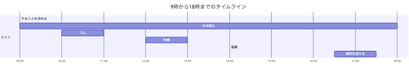

# 始めに
お久しぶりです、るんるんです。
皆さんは集中できないと悩んだことはないですか？
私は何度もあります。その度に何か **Focus On Method** (=集中するための行動) がないかと色々な方法を模索しました。
その中から、ある程度効果があったものを列挙して、さらにそれらを一つひとつ評価して行きたいと思います。
どうか最後までお付き合いください。

# 結論
最初に結論を申し上げると、

#### 水を飲め

です。
どうしてこのような結論になったのか、読み上げて貰えればと思います。

# 判定方法

これから様々なメソッドをご紹介しますが、まずは判定方法について説明します。

- **オススメ度**: 星3つで判定する。各項目の総合的評価
- **手軽さ**: すぐにできるか、時間をどれだけ要するか、特別なものが必要か、etc
- **効果**: 集中へどれだけの効果をもたらすか(筆者の経験)

ルールとしては、「異論は認めるが、あくまで異論」です。
では参りましょう。

# Focus On Methods
## 運動
散歩やランニング、ジムなど。筆者は午前中の集中が切れたタイミングで行く。

#### オススメ度: ⭐️⭐️

##### 手軽さ
運動の程度によるが、散歩やランニングなら、15~30分
ジムだと、行き帰り合わせて1時間ほどかかる
座っている椅子からわざわざ立ち上がって運動するのは、まぁまぁ腰が重い

##### 効果
帰ってきてすぐにデスクに座ることで、1時間程度の集中が見込める
頭がリフレッシュされているのを実感できる

##### 特筆事項
- 言わずもがな健康的な副次効果が見込める

## 寝る
言わずと知れた、人間の最も必要な行為の一つ
ここでは昼寝を対象とする
### オススメ度: ⭐️⭐️⭐️
15分から30分を要する。
人によってはできない行為ではある(会社が積極的に導入すべきだと思うが...)

##### 効果
効果は絶大。昼寝後の1~2時間はゴールデンタイム。

##### 特筆事項
- 眠たくなくても寝る
- 寝過ぎは禁物

## 瞑想する
家族にやっているところを見られるとちょっと恥ずかしい、あれ

#### オススメ度: ⭐️

##### 手軽さ
座って目を瞑るだけ。できるだけ作業する椅子ではない方が良い。
瞑想という行為自体、難易度が高い。
人のよっては1時間できるらしいが、超人だけである。

##### 効果
そこまで集中力が増したと実感できなかった

##### 特筆事項
- 筆者流瞑想:
    - 目を瞑って、呼吸に集中する → 違うことを考えてしまう → 認識する → 呼吸に集中する
    - このサイクル
- 目的は2つ
    - 自分が今何を感じているのかを認識する
    - 呼吸から思考が離れていることを認識して、引き戻す作業
- こう見ると集中力を高めるのが目的ではないような気がする

## 場所を変える
移住のススメ

#### オススメ度: ⭐️⭐️

##### 手軽さ
これは人による。
フリーアドレスを採用している会社ならできるし、そうでないならできない
リモートでも、複数部屋があればできるし、ないならできない

##### 効果
効果はかなり期待できる。家の中で場所を変えるだけでも、効果を実感できる

##### 特筆事項
昇降デスク等を使用して、立ち作業に切り替えるだけでも効果がある

## 時間を決める
いわゆるポモドーロ・テクニック。25分作業5休憩のサイクルを回す。8時間勤務なら16サイクル。

#### オススメ度: ⭐️

##### 手軽さ
アプリ等も出ているので、導入するだけで実行はできる

##### 効果
最初のうちは実感できる。
だんだんダラける傾向にある ←自分が悪い

## とりあえずやる
スマブラの父・桜井政博さんも紹介していた方法 →[とにかくやれ!! 【仕事の姿勢】](https://youtu.be/JV3KOJ_Z4Vs?si=g1rCrxddrLaDGye-)
始める際のハードルをとにかく下げるのがコツ

### オススメ度: ⭐️⭐️

##### 手軽さ
意識の腰を持ち上げるだけ。
始めるハードルをできるだけ下げる(e.g. 簡単なレビューの修正だけやる)

##### 効果
意外とある。自分を騙せた人の勝ち

## やることを決める
1日のTODOを決める
#### オススメ度: ⭐️⭐️

##### 手軽さ
紙とペンがあれば良い。紙に今日やることを全て書き出すだけ。
タスクの粒度はある程度細かい方が良い。
作業中常に見えるところに置いておく。

##### 効果
終えたタスクに線を引くたびにモチベーションが上がる。
##### 特筆事項
- パソコンや携帯、iPad よりも紙が良い
    - 紙は、常に表示されている唯一のデバイス(?)です
    - パソコンに ToDo を書き出しても良いですが、常に表示されている効果かなり大きいです
    - 自分はパソコンやiPad 等でもTODO管理を試しましたが失敗しました
- 仕事終わりに残課題等を整理しておくと、次の日のこの作業がすごく楽になる

## 水を飲む
説明不要

#### オススメ度: ⭐️⭐️⭐️
##### 手軽さ
水を飲むだけ
所要時間1分未満
家の中でも大きい水筒を持ち歩くと、なお手軽さが増す

##### 効果
継続的な集中力が見込める。逆に水分不足だと集中できない。

##### 特筆事項
- トイレに行きたくなるが、これは散歩として捉えることもできる。
- 腸や肌にもとんでもない効果をもたらす。

# 総括
如何だったでしょうか。

「水を飲む」をとにかくオススメしたくてこの記事を書きましたw

誰得ですが、今の私は以下のような感じで仕事を進めてます。

何か参考なれば幸いです。
水を飲むは本当にオススメなので、これだけでも真似して頂きたいなと思います！
