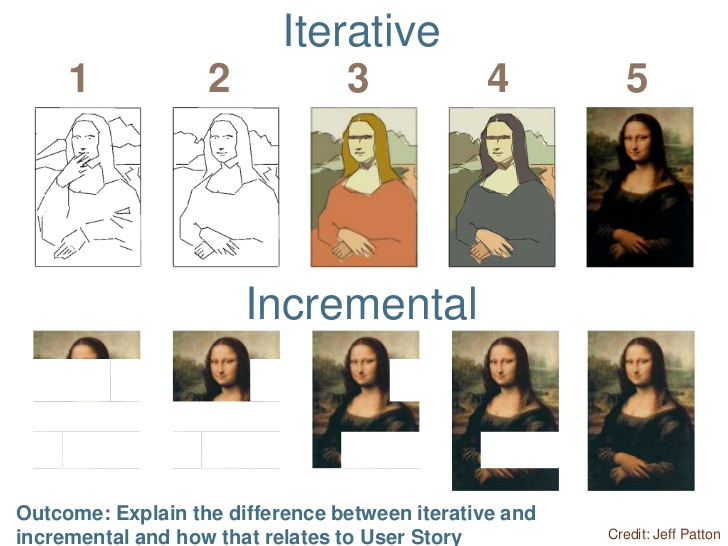

## 始めに
お久しぶりです、るんるんです。

私は自社開発の会社で、 web サービスを開発しています。その中で様々なプロダクトにアサインされ、チーム開発の難しさに何度も直面しました。

ふと思い返すと、この難しさは「チーム開発手法」が原因ではと思い、プロダクトで採用されていた開発手法を調べてみました。
するとどうやら、我々は「インクリメンタル開発」とやらをやっていたそうです。そしてそれに似た概念として「イテレーティブ開発」とやらもあるそうです。

今回はこの2つの開発手法を比較して、どっちのが良いのかを判定したいと思います(短絡的)

## 結論
自社開発系のプロダクトには、

**イテレーティブ開発を導入すべし**

です。

なぜこのような結論になったのか、見て行ってくれればと思います！

## インクリメンタル開発 と イテレーティブ開発

インクリメンタル開発とイテレーティブ開発についてそれぞれどのような特徴を持つのかを説明していきたいと思います。(知ってる人は読み飛ばしてください)

インクリメンタル開発は、いわゆる増分開発です。一つひとつ機能を足していき、完成系を目指す手法を指します。
**中間成果物に価値が認められないのが大きな特徴です。**

イテレーティブ開発は、イテレーション(=繰り返し)毎に開発目標を定め、機能を強化していきます。インクリメンタルに対して、 **最初から価値を作り出します。** 最初は最低限の機能しかありませんが、イテレーション毎に洗練されていくイメージです。

## インクリメンタル開発失敗事例紹介
冒頭で説明した通り、私の会社では自然に( ~惰性で~ )「インクリメンタル開発」が採用されていました。
ここではインクリメンタル開発手法による失敗例を紹介したいと思います

### チーム内で方向性が定まらない
私はサーバーサイドを担当しており、APIを開発したりします。
しかし次のようなことがよく起こりました。

- UI での動作確認をしたいが、フロント側はまだそこに手を付けていないので、待ちが発生する
- いざ UI が完成したら、サーバー側のバグが見つかり手戻りが発生する

### いざプロトタイプ化したら微妙だった
あるプロダクトでの出来事です。
3ヶ月程度のプロダクトだったのですが、フロントエンド担当とバックエンド担当(私)、デザイン担当で別れてそれぞれの完成系を目指して動いていました。
3者が完成した段階でマージして、プロトタイプを作成しました。

しかしいざそのプロトタイプを触ってみると、**デザイン・UIがあまりに微妙だった**のです。キックオフしてから3ヶ月立った段階で、デザイン・UIを1から作り直すことになりました。

2時間*2 のミーティングで話し合ったが正解は出ず、そのままそれぞれのメンバーが違うプロダクトにアサインされ、半お蔵入り状態になっています(現在進行形)。

## どうすれば良かったのか - イテレーティブによる攻略
これらの失敗をイテレーティブ開発で攻略してみようと思います。

### チーム全体の週次目標を立てる
チーム全体でこの1週間何をするのかを話し合い、実行することです。
大事なのは、「チーム全体での目標」であることです。「フロントエンドはこれやります、バックエンドはこれやります」ではなく(インクリメンタルな考え方)、**チームとして何をやるかを共通化する**ことです。

メリットは開発障壁を取り除きやすいことです。
例えば、「サーバー側のエンジニアが UI での動作を見たいが、 フロントの人がやってないから待ちが発生する」ということが起きません。API と UI を同時に開発して結合することで、手戻りも発生せず修正点もすぐに判明します。

### 週次でのアプトプット
チームでの目標を立てたら、**アウトプット**します。
アウトプットの方法としては、社内SNSにて更新内容をプレゼンしたり、開発用環境を公開してプロダクトメンバー以外の人に見てもらうなどです。
特に開発用環境を公開することで、考えもしなかったフィードバックを貰えます。

また一週間でアウトプットしないといけないという緊張感も発生します。やりすぎは注意ですが、あまり納期がない自社開発系のエンジニアには有効な緊張感だと思います。

キックオフして間もないと環境を公開は難しいと思うので、社内SNSで文面や画像だけでも公開すると良いと思います。

## 結び
如何だったでしょうか。
インクリメンタル開発で幾度も失敗してきたからこそ、イテレーティブ開発を取り入れるべきだという結論になりました。
これからはイテレーティブ開発を目指してチーム開発していきますが、もしかしたらインクリメンタル開発に戻ってくるかもしれません。
**まぁやってみないと分からない。** そういうことですね。
